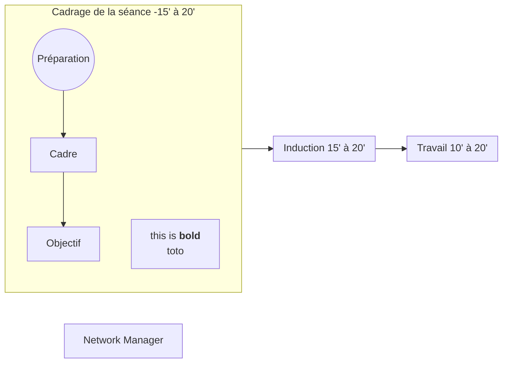

---
{"publish":true,"title":"This is a title","created":"03.08.2025 - 18:12","modified":"03.08.2025 - 18:12","cssclasses":""}
---


# Publishing

## PLantUML test

[[Hypnose/Croyances limitantes]]

  ```plantuml-svg
skinparam svgDimensionStyle false

!theme spacelab
left to right direction

@startuml


state "[[git {git} git]] Cadrage de la scéance - 15' à30'" as CS {
  state "[[%5BNetwork%20Manager {[Network%20Manager {Network Manager} Network Manager} [Network Manager]]] Préparation" as PREP
  state "[[Network Manager]] Le cadre" as CAD
  state "Détermination d'objectif" as DO
  DO : 1 - Etat présent
  DO : 2 - Etat désiré
  DO : 3 - Changements
  DO : 4 - Objectif de la scéance
  
  PREP --> CAD
  CAD --> DO
    
}


state "Induction 15' à 20'" as IND {
  state "Discours Pré-Hypnotique" as DPH
}

state "Travail 10' à 20'" as WORK {
  
}

CS --> IND
IND --> WORK 

@enduml

```

## Mermaid test



## Excalidraw

### Applyed 

![[01-Sandbox/attachements/Publishing 2025-09-21 19.11.49.excalidraw.svg]]


