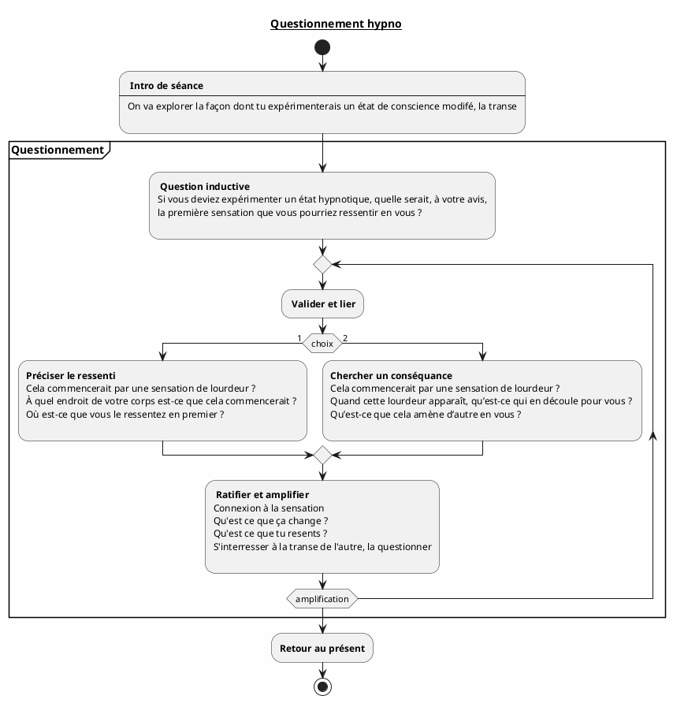

## Questionnement hypno

### Objectif

Le but du questionnement hypnotique est de faire imaginer à votre sujet, étape après étape, l’entrée dans un état d’hypnose tout en lui faisant expérimenter ce qu’il propose.

Cette forme d’accompagnement permet d’éviter les résistances puisque c’est le sujet qui construit lui- même son avancée : tout vient de lui. Il ne peut alors qu’expérimenter ce qu’il propose et invente.

### Séquence

