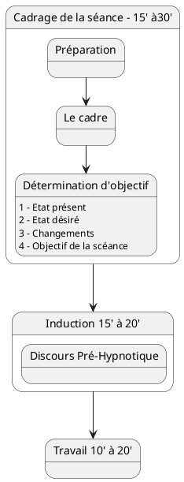
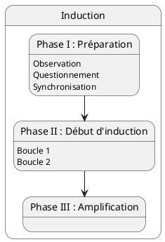

---
{"publish":true,"created":"2025.09.19 18:02","modified":"2025.09.21 15:55","tags":["hypnose"],"cssclasses":""}
---

# Séance type

## Cadrage de la séance

### Préparation

Objectif :
- poser un cadre propice à l’entrée sous hypnose et au changement
- rassurer le sujet
- définir les termes et [[Hypnose/Arche/Discours pré-hypnothique#Concepts clés\|concepts utilisés]]
- écarter les [[Hypnose/Arche/Croyances limitantes\|croyances limitantes]] et autres résistances
- donner envie !  

### Le cadre

Exposer :
- sa façon de travailler
- sa façon d’aborder le changement
- la façon dont la séance d’hypnose va se dérouler
- ce que le client doit faire au début, puis pendant l’accompagnement

### Détermination d'objectif

Anamnèse  
Orienté solution  
Position basse  
Tri sur l'autre  
Curiosité

> [!warning]  
> Pas de jugement  
> Pas de conseil  
> Pas d'analyse de la personne

Collecter l’information sur :
- les fonctionnements de votre sujet 
- son état présent 
- son état désiré 
- ce qui l’empêche de changer 
- ses valeurs 
- ses croyances 
- ses résistances 
- etc...

Outcome :
- stratégies à employer pour mettre votre sujet sous hypnose
- les « blocages » qui ont empêché votre sujet de changer par lui-même, et donc de quels apprentissages inconscients il a besoin

#### Etat présent

But :

- identifier le point de départ 
- prendre le temps d’observer le sujet, de le découvrir 
- installer la relation (mise en place de la synchronisation) 
- observer le niveau émotionnel

> [!tip] Question introductive  
> *« Que se passait-il pour vous jusqu’à maintenant ? Qu’est-ce qui vous a  
amené à vouloir commencer ce travail ? Qu’est-ce qui vous a donné envie  
de faire cette séance ? »*

> [!warning]  
> Etape courte  
> Pas de présupposé, projection, suggestion  
> Le risque pour l’opérateur est de vouloir trop d’informations trop vite.

#### Etat désiré

But : 
- Obtenir un objectif précis : ==SUPER==

| ==S==pécifique                                        | ==U==niquement pour soi                            | ==P==ositif                 | ==E==cologique            |
|:----------------------------------------------------- | -------------------------------------------------- | --------------------------- | ------------------------- |
| reformuler : comment, précisément définir les mots | Pas d'implication de tiers ou d'élément extérieurs | Pas la négation du problème | Des conséquences positive |

#### Changements

> [!tip]  
> *« Qu’est-ce qui va changer en vous pour atteindre cet objectif ? »  
« Qu’est-ce qui peut vous aider à atteindre ce nouvel état ? »  
« De quoi avez-vous besoin pour changer ? » *

#### Objectif de la séance

But :
- mettre en mouvement, première étape

Les étapes sont :

- vérifiables
- faciles à observer
- proches dans le temps
- faciles à observer
- dépendantes du sujet

> [!tip]  
> *« À votre avis, en quoi cette première séance peut-elle amorcer ce  
changement ? »  
« D’après vous, sur quoi peut-on commencer à travailler aujourd’hui pour  
aller vers ce que vous désirez ? »  
« Si vous commencez à aller vers cet objectif, quel sera le premier »  
changement que vous allez constater autour de vous/en vous ? »  
« Comment allez-vous vérifier que votre ressenti est différent ? »  
« Que pourriez-vous faire après cette séance que vous auriez eu du mal à  
faire avant ? À quel moment pourrez-vous le faire ? »*

#### Lier l'objectif à une valeur forte

But : 
- Créer du sens, de l’émotion et de l’implication en reliant l’objectif à une valeur forte

> [!tip]  
>*« En quoi est-ce important pour vous ? »  
« Quelle est l’intention positive de ce but ? »  
« Quelle est votre motivation ? »  
« Qu’est-ce que cela va vous permettre ? »*

#### Projection vers l'avenir

Projection dans un futur où l'objectif est pleinement atteint.  
Précise, Visuelle, Auditive, Kinesthésique.

#### Vérifier l'écologie

L'objectif a des conséquences positives ou assumées

> [!tip] Title  
>*« Pensez à toutes les conséquences de l’objectif sur vous, sur vos proches,  
votre travail… Est-ce qu’il y a des choses à prendre en compte ? »  
« Si vous atteignez cet objectif, quelles pourraient être les pires conséquences  
possibles ? Une fois parvenu au résultat, serez-vous satisfait à 100% du  
changement obtenu ? »*

## Induction

### Phase I - préparation

- [[Hypnose/Arche/Discours pré-hypnothique]]

### Phase II - début d'induction

- [[Hypnose/Arche/Induction - Tests Hypno]]

### Phase III - amplification

- [[Hypnose/Arche/Chemins hypno]]
- [[Hypnose/Arche/Phénomènes Hypno]]

[[Hypnose/Arche/Inductions]]

## Travail

