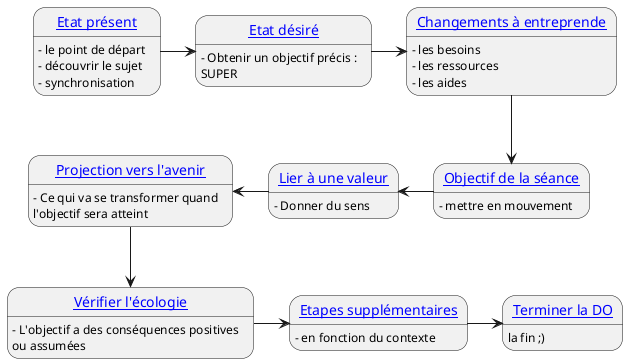

---
{"publish":true,"created":"2025.09.30 17:58","modified":"2026.04.07 12:34","tags":["hypnose"],"cssclasses":""}
---

# Détermination d'objectif - Anamnèse  

## Principes

- Orienté solution  
- Position basse  
- Tri sur l'autre  
- Curiosité

> [!warning]  
>- Pas de jugement  
>- Pas de conseil  
>- Pas d'analyse de la personne

Collecter l’information sur :

- les fonctionnements de votre sujet 
- son état présent 
- son état désiré 
- ce qui l’empêche de changer 
- ses valeurs 
- ses croyances 
- ses résistances 
- etc...

Outcome :

- stratégies à employer pour mettre votre sujet sous hypnose
- les « blocages » qui ont empêché votre sujet de changer par lui-même, et donc de quels apprentissages inconscients il a besoin

## Etat présent

But :

- identifier le point de départ 
- prendre le temps d’observer le sujet, de le découvrir 
- installer la relation (mise en place de la synchronisation) 
- observer le niveau émotionnel

> [!tip] Question introductive  
> *« Que se passait-il pour vous jusqu’à maintenant ? »*
>   
> *Qu’est-ce qui vous a amené à vouloir commencer ce travail ? »*
>   
> *Qu’est-ce qui vous a donné envie de faire cette séance ? »*  
> ^tip-etat-present

> [!warning]  
>- Etape courte  
>- Pas de présupposé, projection, suggestion  
>- Le risque pour l’opérateur est de vouloir trop d’informations trop vite.

## Etat désiré

But : 
- Obtenir un objectif précis : ==SUPER==

| ==S==pécifique                                        | ==U==niquement pour soi                            | ==P==ositif                 | ==E==cologique            |
| :---------------------------------------------------- | -------------------------------------------------- | --------------------------- | ------------------------- |
| reformuler : comment, précisément définir les mots | Pas d'implication de tiers ou d'élément extérieurs | Pas la négation du problème | Des conséquences positive |
|                                                       |                                                    |                             |                           |

> [!Tip]  Etat désiré  
> *« Que souhaitez-vous ? »*  
> *« Quels résultats attendez vous ?  »*  
> *« Comment saurez-vous que vous l'avez atteint ? »*  
 > *« Quels sont les inconvénients à l'atteindre ? »*  
 > *« Quels sont les obstacles à la réalisation de cet objectif ? »*  
 > *« De quelles ressources disposez-vous pour atteindre cette objectifs, qu'avez-vous déjà mis en oeuvre ? »*  
 > *« Quelles sont les étapes à parcourir ? »*  
 > *« Quel est le premier petit pas à effectuer ? »*  
  ^do-etat-desire

## Changements

> [!tip]  Changements  
> *« Qu’est-ce qui va changer en vous pour atteindre cet objectif ? »*  
> 
>*« Qu’est-ce qui peut vous aider à atteindre ce nouvel état ? »*
>
>*« De quoi avez-vous besoin pour changer ? »*  
>^do-changements

## Objectif de la séance

Mettre en mouvement, première étape.

Les étapes sont :

- vérifiables
- faciles à observer
- proches dans le temps
- faciles à observer
- dépendantes du sujet

> [!tip]  
>*« À votre avis, en quoi cette première séance peut-elle amorcer ce changement ? »*
>
>*« D’après vous, sur quoi peut-on commencer à travailler aujourd’hui pour aller vers ce que vous désirez ? »*
>
>*« Si vous commencez à aller vers cet objectif, quel sera le premier changement que vous allez constater autour de vous/en vous ? »*  
>
>*« Comment allez-vous vérifier que votre ressenti est différent ? »*  
>
>*« Que pourriez-vous faire après cette séance que vous auriez eu du mal à faire avant ? À quel moment pourrez-vous le faire ? »*

## Lier l'objectif à une valeur forte

En quoi ce que je veux atteindre est motivant ?  
Un objectif doit être attaché à une valuer qui le dépasse, la valeur n'est pas l'objectif. L'objectif est un moyen d'approcher de vire ca valeur.  

Créer du sens, de l’émotion et de l’implication en reliant l’objectif à une valeur forte.

1. Conscientiser les valeurs qui sont derrière l'objectif
2. Se relier à ces valeurs (l'objetir pour)
3. Créer du sens, de l'émotion
4. Créer de la motivation

> [!warning] Attention  
> Attention aux projections !

> [!tip]  
>*« En quoi est-ce important pour vous ? »*
>  
>*« Quelle est l’intention positive de ce but ? »*
>   
>*« Quelle est votre motivation ? »*
>  
>*« Qu’est-ce que cela va vous permettre ? »*

## Projection vers l'avenir

Projection dans un futur où l'objectif est pleinement atteint.

Tout ce qui va se transformer quand l'objectif sera atteint  
Description précise, Visuelle, Auditive, Kinesthésique.  
Association à la situation, *« Imagine que tu y es, qu'est-ce qui se passe, qu'est ce qui change ? »*
- Au présent
- Pas de réponse vague
- Eventuellement, légère induction ([[Hypnose/Induction - Spirale Sensorielle\|Spiralle sensorielle]]) quelque suggestions pour activer l'imaginaire.

> [!tip]  
>*« Comme ça sera vraiment quand tu auras atteint ton objectif ? »*
>
> *« Imagine que tu y es, qu'est-ce qui se passe, qu'est ce qui change ? »*
> 
> *« Tu es arriver dans cet avenir là, on est l'été. Ressent ce qui est différent à l'intérieur de toi, scanne ton corp, tes ressentis »*
> 
> *« Regarde autour de toi, qu'est qui était différent il y a 6 mois »*

## Vérifier l'écologie

Il est rare qu'un objectif soit à 100% écologique.  
S'il l'était il n'y aurai aucune raison qu'il existe des résistances à l'idée de l'atteindre. 

L'objectif a des conséquences positives ou assumées

Un changement peut amener 3 grandes réponses :

1. tout va bien (rare, mais possible)
2. ok, mais ça coince à un  endroit, il faut faire attention à quelque chose => ajustement de l'objectif, ou conséquences assumées
3. Remise en question de l'objectif

> [!info]  
> A cette étape la question de l'écologie n'a pas besoin d'être résolue, elle doit être posée

> [!tip]  
>*« Pensez à toutes les conséquences de l’objectif sur vous, sur vos proches, votre travail… Est-ce qu’il y a des choses à prendre en compte ? »*
>
>*« Si vous atteignez cet objectif, quelles pourraient être les pires conséquences possibles ? Une fois parvenu au résultat, serez-vous satisfait à 100% du changement obtenu ? »*

## Etapes supplémentaires

### Premier pas vers le changement

Cf. [[Hypnose/Détermination objectif#Objectif de la séance]]
 
 A court terme
 
*« Comment tu sauras que ça a déjà commencé à changer ? »*

Intérêt : 

- Renforce la motivation
- Diminue la pression d'atteindre un grand objectif
- Ramène vers le concret, un plan d'action

### Amplifier l'emotion positive

Utile quand la personne est un peu dissociée

A placer [[Hypnose/Détermination objectif#Etat désiré\|l'évocation de l'état désiré]], [[Hypnose/Détermination objectif#Lier l'objectif à une valeur forte\|recherche de valeur]] 

Utiliser les sous modalité, [[Hypnose/Protocole - Ancrage\|l'ancrage]] pour augmenter l'association à l'objectif

### La Frustration

Créer une inversion de rapport avec l'objectif.

On accorde plus d'importance à ce qui incertain.

Créer le doute

### Connection aux ressources/qualités

Pour les personnes qui n'ont pas confiance en eux

Dans une légère transe

> [!Tip]  
> *« J'aimerais maintenant, qu'en pensant à cet objectif,  inconsciemment, tu te connectes à toutes les ressources les qualités qui peuvent t'aider à l'atteindre. Et c'est comme si à un à un niveau inconscient, il y avait une recherche de tout ce qui peut être utile dans ton expérience, dans tes connaissances, dans tes savoir. Et tout ça peut même remonter jusqu'à la conscience. »*

## Terminer la DO

Récapituler les points clés  
	ajustements possible

Transiter ver le [[Hypnose/Discours pré-hypnothique]] discrètement, ==sans l'annoncer==

> [!Tip]  
> *« Ce que j'aimerais maintenant, c'est que vous puissiez prendre quelques instants pour repenser à tout ce que vous m'avez dit, parce que vous savez, une fois qu'on a parler d'un objectif la plus part du temps on commence à sentir que ça travail à l'intérieur, que nos questionnements commencent à changer, que nos sensations commencent à être différentes. et je ne sais pas si vos avez remarqué que comme le simple fait d'avoir parler de tout ça, d'avoir répondu à ces questions, d'avoir cherché tout ça fait que déjà il y a une focalisation qui est un petit peu différente. »*

Une DO, n'est jamais vraiment finie

> [!info] Astuces
> - Fixer un temps maximum à ne pas dépasser, ne pas se perdre dans les détails
> - Quest-ce que je recherche à chaque étape
> - Faire toute les étapes, méthodiquement, pendant un certain temps

