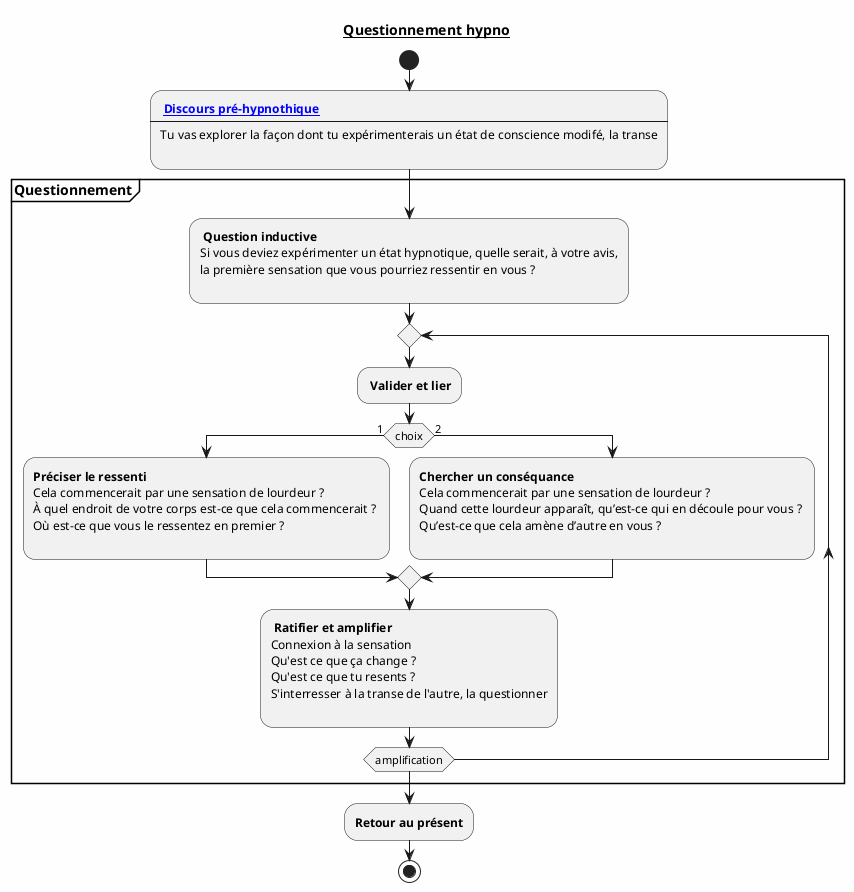

---
{"publish":true,"created":"2025.07.24 11:43","modified":"2025.09.30 17:06","tags":["hypnose","induction"],"cssclasses":""}
---

# Questionnement hypnotique

## Objectif

Le but du questionnement hypnotique est de faire imaginer à votre sujet, étape après étape, l’entrée dans un état d’hypnose tout en lui faisant expérimenter ce qu’il propose.

Cette forme d’accompagnement permet d’éviter les résistances puisque c’est le sujet qui construit lui- même son avancée : tout vient de lui. Il ne peut alors qu’expérimenter ce qu’il propose et invente.

## DPH

*«Tu vas explorer par toi même la façon dont tu entres facilement dans un état de conscience modifiée. Petit à petit tu vas trouver le meilleur chemin pour atteindre cet état d'hypnose. Comme c'est toi qui construit le chemin ce sera le plus adapté pour modifier ton état de conscience. Je te guiderai dans les étapes et tu verras qu'à chaque étape cet état se modifiera de plus en plus. Dans un instant, je te poserai une première question, tu pourras y répondre consciemment dans ton état présent/ordinaire, ensuite je te poserai d'autres questions et tu verras qu'à mesure que ton état de conscience se modifie il faudra aller chercher plus loin les réponses, c'est bon signe :) Tu pourras observer attentivement les changements dans ton corps et dans tes sensations. C'est bon pour toi, tu es prêt à emprunter ce chemin ?»*

## Chemin désiré

Ici, c'est le sujet qui construit son chemin, on peut néanmoins le guider au travers des questions vers un [[Hypnose/Phénomènes Hypnotiques\|phénomène hypnotique]] que l'on ratifiera pour valider l'état de transe
## Séquence
I#credential
