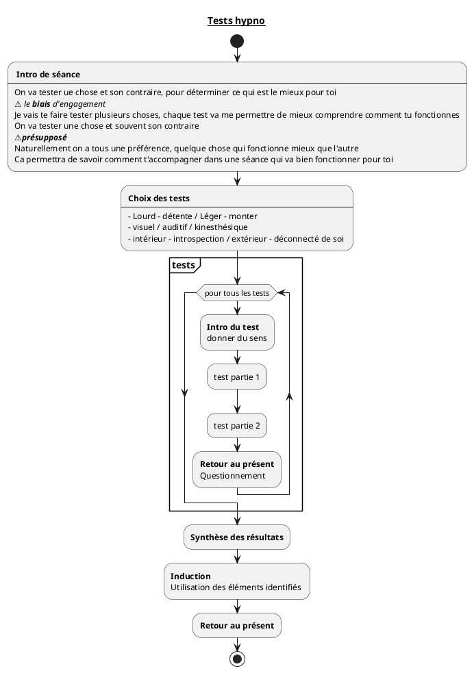

---
{"publish":true,"created":"03.07.2025 - 17:45","modified":"03.07.2025 - 17:49","tags":["hypnose"],"cssclasses":""}
---

# Induction -Tests Hypnotiques

## Objectif

Montrer à la personne qu'elle peut créer sa séance sur mesure

Utile pour les personnes :
- qui ont peur de la perte de contrôle
- qui ont besoin d'être impliqué
- qui on besoin de dire non

Exemple de tests :

- Centrer le sujet sur l’interne, le corps / sur le monde extérieur.
- Centrer sur le visuel / sur l’auditif / sur le kinesthésique.
- Créer de la détente / créer du dynamisme.
- Créer de la concentration / créer du lâcher-prise.
- Centrer sur la droite / sur la gauche (lévitation de la main)
- Avant / arrière (debout, bascule) 
- Accélérer la respiration / ralentir les rythmes.

## Séquence

