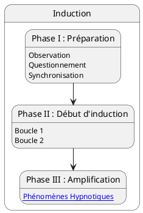

---
{"publish":true,"created":"2025.09.22 19:56","modified":"2025.09.30 18:11","tags":["hypnose","induction"],"cssclasses":""}
---

# Inductions

## Phase I - préparation

- [[Hypnose/Discours pré-hypnothique]]
- [[Hypnose/Chemins hypnotiques]]

## Phase II - début d'induction

## Phase III - amplification

## Les inductions

- [[Hypnose/Induction - Tests Hypnotiques\|Tests Hypnotiques]]
- [[Hypnose/Induction - Questionnement Hypnotique\|Questionnement Hypnotiques]]
- Souvenir hypnotique
- Vision périphérique
- Spirale sensorielle
- Contraction/Décontraction
- Association/Dissociation
- Saturation
- Confusion
- ...
