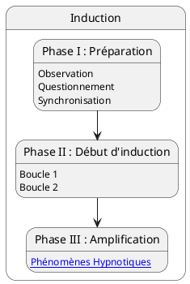

---
{"publish":true,"created":"2025.09.22 19:56","modified":"2025.09.30 18:11","tags":["hypnose","induction"],"cssclasses":""}
---

# Inductions

## Phase I - préparation

- [[Hypnose/Discours pré-hypnothique]]
- [[Hypnose/Chemins Effets]]

## Phase II - début d'induction

## Phase III - amplification

## Les inductions

- [[Hypnose/Induction - Tests Hypnotiques\|Tests Hypnotiques]] (cf. [[Livret Cycle 1 - Technicien 1.pdf#page=61&selection=14,0,16,17|Livret Cycle 1 - Technicien 1, p.61]])
- [[Hypnose/Induction - Questionnement Hypnotique\|Questionnement Hypnotiques]] (cf. [[Livret Cycle 1 - Technicien 1.pdf#page=94&selection=9,0,11,28|Livret Cycle 1 - Technicien 1, p.94]])
- Souvenir hypnotique (cf. [[Livret Cycle 1 - Technicien 1.pdf#page=98&selection=7,0,9,22|Livret Cycle 1 - Technicien 1, p.98]])
- [[Hypnose/Induction - Vision périphérique\|Vision périphérique]] (cf. [[Livret Cycle 1 - Technicien 2.pdf#page=39&selection=10,0,12,24|Livret Cycle 1 - Technicien 2, p.39]])
- [[Hypnose/Induction - Spirale Sensorielle\|Spirale sensorielle]] (cf. [[Livret Cycle 1 - Technicien 2.pdf#page=43&selection=10,0,10,26|Livret Cycle 1 - Technicien 2, p.43]])
- Contraction-Décontraction (cf. [[Livret Cycle 1 - Technicien 2.pdf#page=46&selection=9,0,11,11|Livret Cycle 1 - Technicien 2, p.46]])
-  [[Hypnose/Induction - Association-Dissociation\|Association-Dissociation]] (cf. [[Livret Cycle 1 - Technicien 2.pdf#page=54&selection=9,0,11,26|Livret Cycle 1 - Technicien 2, p.54]])
- Saturation (cf. [[Livret Cycle 1 - Technicien 2.pdf#page=51&selection=20,0,20,17|Livret Cycle 1 - Technicien 2, p.51]]) (video: [Un instant…](https://www.arche-online.com/courses/take/technicien-2/lessons/58542445-demonstration-saturation))
- Confusion (cf. [[Livret Cycle 1 - Technicien 2.pdf#page=49&selection=10,0,12,14|Livret Cycle 1 - Technicien 2, p.49]])
- ...
