# Protocole - Transformer un symptôme en signal - Rossi

```plantuml-svg
skinparam svgDimensionStyle false

!theme spacelab
'!theme crt-amber
'left to right direction

@startuml


state "[[Protocole%20-Transformer%20un%20sympt%C3%B4me%20en%20signal%20-%20Rossi#Etape%201%20-%20Evaluation%20de%20l'intensit%C3%A9%20du%20sympt%C3%B4me {Protocole -Transformer un symptôme en signal - Rossi#Etape 1 - Evaluation de l'intensité du symptôme} Evaluation du symptôme]]" as STEP1 {
	STEP1 : - echelle 1 à 10
	STEP1 : - association symptôme et signal
}

state "[[Protocole%20-Transformer%20un%20sympt%C3%B4me%20en%20signal%20-%20Rossi#Etape%202%20-%20Recherche%20du%20sens%20du%20sympt%C3%B4me {Protocole -Transformer un symptôme en signal - Rossi#Etape 2 - Recherche du sens du symptôme} Recherche du sens]]" as STEP2 {
    STEP2 : - signification profonde
    STEP2 : - induction
}

state "[[Protocole%20-Transformer%20un%20sympt%C3%B4me%20en%20signal%20-%20Rossi#Etape%203%20-%20Ratification {Protocole -Transformer un symptôme en signal - Rossi#Etape 3 - Ratification} Ratification]]" as STEP3 {
    STEP3 : - utilisation du symptôme en signal
}

state "[[Protocole%20-Transformer%20un%20sympt%C3%B4me%20en%20signal%20-%20Rossi#Etape%204%20-%20R%C3%A9%C3%A9valuation%20de%20l'intensit%C3%A9%20du%20sympt%C3%B4me {Protocole -Transformer un symptôme en signal - Rossi#Etape 4 - Réévaluation de l'intensité du symptôme} Réévaluation de l'intensité]]" as STEP4 {
}

STEP1 -right-> STEP2
STEP2 -right-> STEP3
STEP3 -right-> STEP4


@enduml


```

## Etape 1 - Evaluation de l'intensité du symptôme

> [!TIP] Evaluation du symptôme  
> *« Sur une échelle de 1 à 10, où 10 représenterait le pire état possible, quel chiffre exprimerait l’intensité de ce symptôme, de cette douleur, de cet inconfort ou quoi que ce soit d’autre, là, ==maintenant== [[Hypnose/Protocole -Transformer un symptôme en signal - Rossi#^decode0\|1]]? »*
>  
> *« Reconnaissez comme cette ==intensité du symptôme== est en fait un ==signal de la force==([[Hypnose/Protocole -Transformer un symptôme en signal - Rossi#^decode1\|2]]) avec laquelle une autre partie de vous, plus profonde, a besoin d’être ==reconnue et comprise, là, maintenant==([[Hypnose/Protocole -Transformer un symptôme en signal - Rossi#^decode2\|3]]). »*

1. Suggestion que la situation présente va évoluer ^decode0
2. Lien entre l'intensité et le niveau de reconnaissance, plus on écoute plus la part inconsciente plus l'intensité va diminuer ^decode1
3. C'est maintenant que le travail doit se faire, s'adresse aussi à l'inconscient, présupposé de collaboration conscient/inconscient ^decode2

*(Pause...)*  Il y a quelque chode à chercher

## Etape 2 - Recherche du sens du symptôme

> [!Tip] Recherche du sens du symptôme
> 
> *« Quand votre esprit intérieur (inconscient, partie créative, etc.) sera prêt à vous ==apporter de l’aide== ([[Hypnose/Protocole -Transformer un symptôme en signal - Rossi#^e2d1\|1]])pour accéder aux significations ==plus profondes==([[Hypnose/Protocole -Transformer un symptôme en signal - Rossi#^e2d2\|2]]) de vos symptômes, vous pourrez vous détendre, vous permettre d’être plus à l’aise et finalement fermer vos yeux ? »*
> 
> *(Pause)* - Cette phrase équivaut pour Rossi à une induction entière

1. L'inconscient est aidant et non celui qui apporte la solution, il faut un engagement de la personne ^e2d1
2. Présuppose que la transe permet d'aller plus loin ^e2d2

> [!tip] Questionnement
> 
> *« Vous pouvez passer en revue ce qui est à l’origine de ces symptômes ? »*
> 
> *(Pause)* - Le silence incite à la recherche
> 
> *« Vous pouvez demander à votre symptôme ce qu’il vous dit ? »*
> 
> *(Pause)*
> 
> *« Maintenant, vous voudrez peut-être discuter avec votre symptôme des changements qu’il est nécessaire d’opérer dans votre vie ? ([[Hypnose/Protocole -Transformer un symptôme en signal - Rossi#^e3d1\|1]]) »*
> 
> (Négociation avec l’inconscient ; le conscient n’a pas toujours d’éléments concrets dans cette étape.)

1. Idée de la collaboration  
Idée de la nécessité de faire des changements  
Le *peut-être* est au début, suivi du *nécessaire*  ^e3d1

## Etape 3 - Ratification

> [!TIP] Ratification  
> *« Comment allez-vous, à partir de maintenant, utiliser votre symptôme comme un signal important ? Comment allez-vous communiquer avec lui ? »*

On n'evacue pas le symptôme, on l'utilise comme conseiller  
Le symptôme devient un signal un

## Etape 4 - Réévaluation de l'intensité du symptôme

