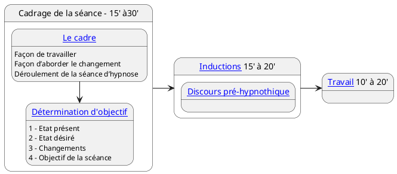

---
{"publish":true,"created":"2025.09.19 18:02","modified":"2025.09.30 18:14","tags":["hypnose"],"cssclasses":""}
---

# Séance type

- [[Hypnose/Cadrage]]
- [[Hypnose/Détermination objectif\|Détermination d'objectif (DO)]]
- [[Hypnose/Inductions]]
- [[Hypnose/Protocoles]]

